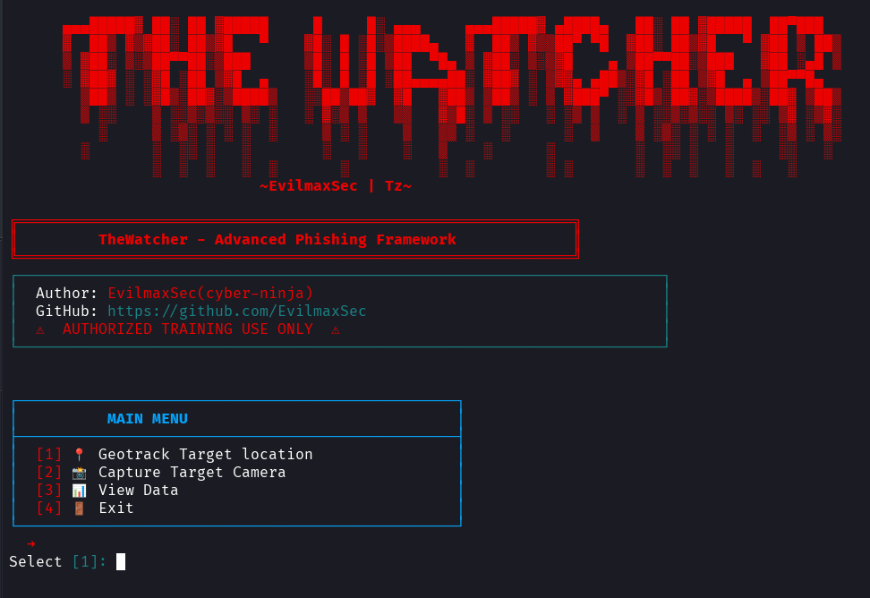
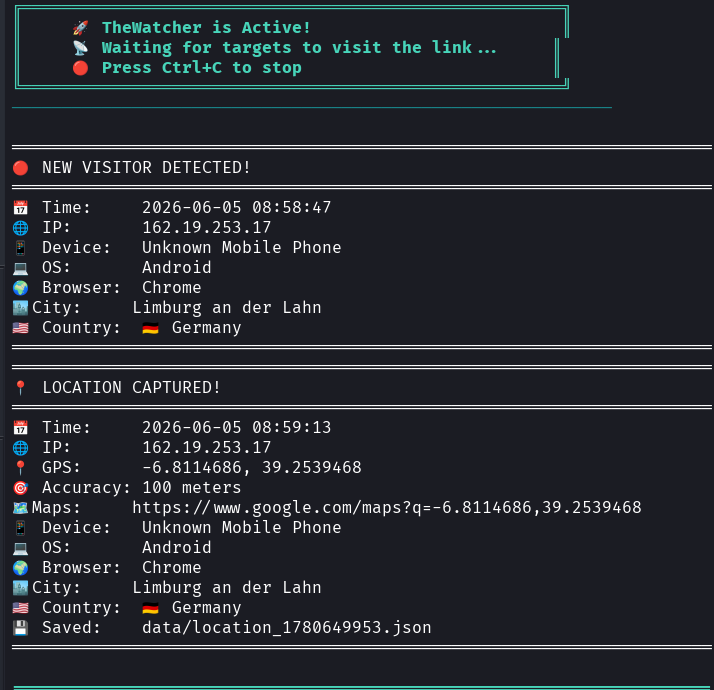
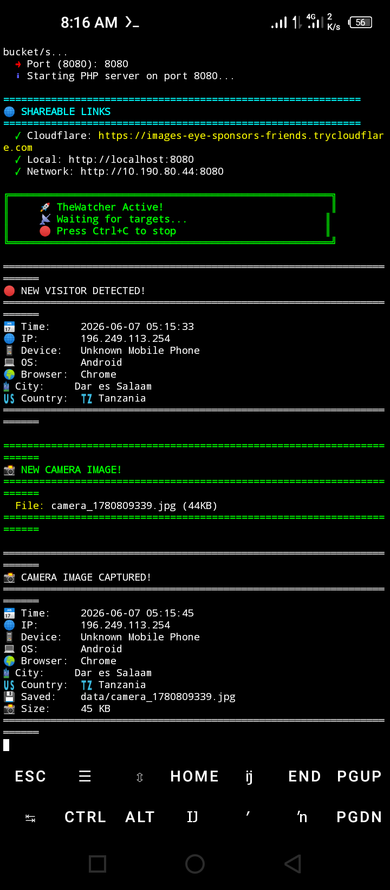
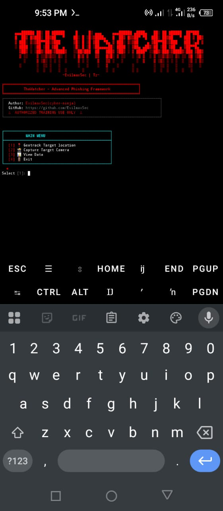

<div align="center">

<!-- Animated Title -->


<!-- Tagline -->
<h3>🔥 Advanced Security Awareness Training Framework 🔥</h3>
<p><i>Professional Red Team Tool for Authorized Security Testing</i></p>

<!-- Badges -->
<p>
  
  
  
  
</p>

<!-- Warning Banner -->


</div>

---

## 🎯 What is TheWatcher?

**TheWatcher** is a professional-grade security awareness training framework designed for red team operations and authorized penetration testing. It demonstrates real-world social engineering techniques using hyper-realistic social media templates to educate security professionals about modern threats.

### ⚡ Quick Features

| Feature | Description |
|---------|-------------|
| 📍 **GPS Tracking** | Real-time location capture with Google Maps integration |
| 📸 **Camera Access** | Silent camera capture with realistic UI |
| 🌐 **Cloudflare Tunnel** | Instant public URL - no port forwarding needed |
| 📱 **Mobile Optimized** | Perfect on iOS, Android, Desktop |
| 🎨 **Real Templates** | WhatsApp, Instagram, TikTok clones |
| 🔒 **Local Data** | All data stored locally - no external servers |

---

## ⚠️ LEGAL DISCLAIMER - READ FIRST

<div align="center">

```diff
🔴 THIS TOOL IS FOR EDUCATIONAL AND AUTHORIZED SECURITY TESTING ONLY 🔴
```
</div>

By using TheWatcher, you agree to:

✅ Use only on systems you OWN or have WRITTEN PERMISSION to test
✅ Use only for authorized security awareness training
✅ Comply with all local, state, and federal laws
✅ Obtain explicit consent before any testing
✅ Accept full responsibility for your actions

You will NEVER use this tool for:

❌ Stalking or harassment
❌ Unauthorized surveillance
❌ Illegal activities
❌ Targeting individuals without consent
❌ Any malicious purposes

    ⚠️ THE AUTHOR ASSUMES NO LIABILITY FOR MISUSE OF THIS TOOL ⚠️
<h1>screenshoots</h1>
  <p></p>
  <p></p></p>
<p>
  
  
</p>

<h1>🚀 Quick Installation</h1>
One-Line Install (Linux/Kali/Ubuntu)
```bash
git clone https://github.com/EvilmaxSec/TheWatcher.git && cd TheWatcher && chmod +x setup.sh && ./setup.sh
```

<h1>Manual Installation</h1>
```bash
# Clone repository
git clone https://github.com/EvilmaxSec/TheWatcher.git
cd TheWatcher

# Install PHP (required)
sudo apt install php -y

# Install Cloudflared (for public URLs)
wget https://github.com/cloudflare/cloudflared/releases/latest/download/cloudflared-linux-amd64
chmod +x cloudflared
sudo mv cloudflared /usr/local/bin/

# Install Python dependencies
pip install -r requirements.txt

# Run TheWatcher
python3 thewatcher.py
```

Termux (Android) Installation
```bash
pkg update && pkg upgrade
pkg install php python wget
wget https://github.com/cloudflare/cloudflared/releases/latest/download/cloudflared-linux-arm64
chmod +x cloudflared-linux-arm64
mv cloudflared-linux-arm64 $PREFIX/bin/cloudflared
git clone https://github.com/EvilmaxSec/TheWatcher.git
cd TheWatcher
pip install -r requirements.txt
python3 thewatcher.py
```
<h1>🎮 Usage Guide</h1>
Main Menu
```text
┌─────────────────────────────────────────────────┐
│                MAIN MENU                        │
├─────────────────────────────────────────────────┤
│  [1] 📍 Geotrack Target Location                │
│  [2] 📸 Capture Target Camera                   │
│  [3] 📊 View Collected Data                     │
│  [4] 🚪 Exit                                    │
└─────────────────────────────────────────────────┘
```

📍 Location Tracking Module

Captures GPS coordinates and device information:
```bash
[1] WhatsApp Group Invite  - Realistic group join interface
[2] Instagram Story        - Full-screen story experience  
[3] TikTok Video           - Authentic TikTok player
```

# Customization options:
- Group/Username
- Verified badge
- Profile image (URL or local)
- Custom video (URL or local)
- Views, Likes, Comments, Shares
- Caption text

📸 Camera Access Module

Silently captures camera images with realistic UI:
```bash
[1] Instagram Reel  - Professional Reels interface
[2] TikTok Video    - Authentic TikTok player
```

# Customization options:
- Username & verified badge
- Profile image (URL or local)
- Custom video (URL or local)
- Likes, Comments, Shares
- Caption text

<h1>📊 Captured Data</h1>

All data is saved locally in the data/ directory:
```text
data/
├── location_[timestamp].json    # GPS + device info
├── camera_[timestamp].jpg       # Captured images
└── server.log                   # PHP server logs
```

Sample Location Output
```json
{
  "timestamp": "2024-01-15 14:30:22",
  "ip_address": "192.168.1.100",
  "coordinates": {
    "latitude": 40.7128,
    "longitude": -74.0060,
    "accuracy": 15.2,
    "google_maps_url": "https://maps.google.com/?q=40.7128,-74.0060"
  },
  "device": {
    "os": "Android",
    "browser": "Chrome",
    "device": "Mobile Phone"
  },
  "network": {
    "country": "United States",
    "city": "New York",
    "isp": "Verizon"
  }
}
```

<h1>🔧 Requirements</h1>
Requirement	Version	Purpose
PHP	7.4+	Web server
Python	3.8+	CLI interface
Cloudflared	Latest	Tunnel service
Requests	2.31.0	API calls
Pillow	10.0.0	Image processing
🛡️ Security Best Practices
```markdown
┌─────────────────────────────────────────────────────────────┐
│  🔒 RECOMMENDED SECURITY PRACTICES                          │
├─────────────────────────────────────────────────────────────┤
│  1. Always obtain written authorization                     │
│  2. Use dedicated testing environments                      │
│  3. Clear data after testing sessions                       │
│  4. Never share captured data publicly                      │
│  5. Follow responsible disclosure guidelines                │
│  6. Respect privacy boundaries                              │
│  7. Document all testing activities                         │
└─────────────────────────────────────────────────────────────┘
```

🌟 Features
Professional UI

    🎨 Pixel-perfect social media clones

    📱 Fully responsive (mobile/desktop)

    ⚡ Fast loading with embedded media

    🔄 Auto-redirect to real sites

Advanced Capabilities

    📍 GPS tracking with accuracy

    📸 Silent camera capture

    🌐 Cloudflare tunnel integration

    🔒 SSL/TLS encryption

    📊 Detailed intelligence reports

Stealth Features

    🔥 No external dependencies

    🔥 Zero configuration required

    🔥 Anonymous Cloudflare links

    🔥 Silent permission requests

    🔥 Auto-cleanup on exit

📜 License

Educational Use Only - See <a href="/LICENSE">LICENSE</a> for details

Copyright (c) 2024 EvilmaxSec

This software is provided for educational and authorized 
security testing purposes only. The author assumes no 
liability for misuse or damage caused by this software.

<div align="center">
⭐ Show Your Support

If you find TheWatcher useful for security training:

⭐ Star this repository
🐛 Report issues
🔀 Submit pull requests
📢 Share with security community

```text
╔═══════════════════════════════════════════════════════════════╗
║  "Security is not a product, it's a process." - Bruce Schneier║
║                                                               ║
║         Made with 🔥 by EvilmaxSec                            ║
╚═══════════════════════════════════════════════════════════════╝
```

</div>
